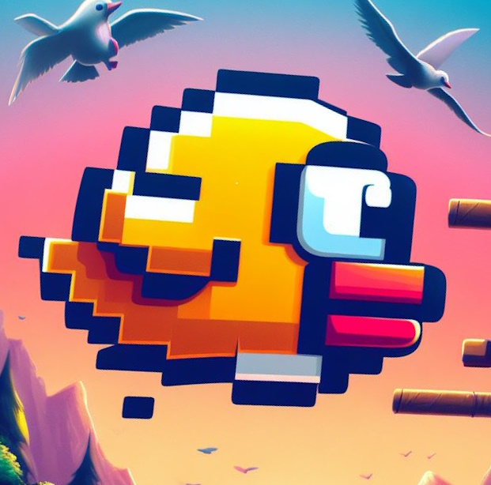

[![Contributors][contributors-shield]][contributors-url]
[![Issues][issues-shield]][issues-url]
[![License][license-shield]][license-url]


<!-- PROJECT LOGO -->
<br />
<div align="center">
  <a href="https://github.com/Times0/FlappyBirdAI">
    
  </a>

<h3 align="center">Flappy Bird AI</h3>

  <p align="center">
    Simple AI for Flappy Bird using <a href="https://nn.cs.utexas.edu/downloads/papers/stanley.cec02.pdf"> NEAT </a> algorithm. Inspired from <a href="https://youtu.be/MPFWsRjDmnU?list=PLzMcBGfZo4-lwGZWXz5Qgta_YNX3_vLS2">this video</a>. 
    <br />
    <a href="https://github.com/Times0/FlappyBirdAI/issues">Report Bug</a>
    ·
    <a href="https://github.com/Times0/FlappyBirdAI/issues">Request Feature</a>
  </p>
</div>


<!-- TABLE OF CONTENTS -->
<details>
  <summary>Table of Contents</summary>
  <ol>
    <li>
      <a href="#about-the-project">About The Project</a>
      <ul>
        <li><a href="#built-with">Built With</a></li>
      </ul>
    </li>
    <li>
      <a href="#getting-started">Getting Started</a>
      <ul>
        <li><a href="#prerequisites">Prerequisites</a></li>
        <li><a href="#installation">Installation</a></li>
      </ul>
    </li>
    <li><a href="#usage">Usage</a></li>
    <li><a href="#roadmap">Roadmap</a></li>
    <li><a href="#contributing">Contributing</a></li>
    <li><a href="#license">License</a></li>
    <li><a href="#contact">Contact</a></li>
    <li><a href="#acknowledgments">Acknowledgments</a></li>
  </ol>
</details>


<!-- ABOUT THE PROJECT -->
Here is what it looks like after the training:


## About The Project
Training an AI to play Flappy Bird using NEAT algorithm.

NEAT = NEUROEVOLUTION OF AUGMENTING TOPOLOGIES 

<!-- GETTING STARTED -->

## Getting Started

1. Clone the repo

```
git clone https://github.com/Times0/FlappyBirdAI.git
```

2. Install requirements
``` 
pip install -r requirements.txt
```


3. Run the program

```
python main.py
```

If there is a file `best_genome` in the folder, the program will load it and use it to play the game.
Otherwise, it will train a new AI and save it in the file `best_genome`.


# Training


<!-- CONTACT -->

## Contact

times.coding@gmail.com
<!-- MARKDOWN LINKS & IMAGES -->
<!-- https://www.markdownguide.org/basic-syntax/#reference-style-links -->

[contributors-shield]: https://img.shields.io/github/contributors/Times0/FlappyBirdAI.svg?style=for-the-badge

[contributors-url]: https://github.com/Times0/FlappyBirdAI/graphs/contributors

[forks-shield]: https://img.shields.io/github/forks/Times0/FlappyBirdAI.svg?style=for-the-badge

[forks-url]: https://github.com/Times0/FlappyBirdAI/network/members

[stars-shield]: https://img.shields.io/github/stars/Times0/FlappyBirdAI.svg?style=for-the-badge

[stars-url]: https://github.com/Times0/FlappyBirdAI/stargazers

[issues-shield]: https://img.shields.io/github/issues/Times0/FlappyBirdAI.svg?style=for-the-badge

[issues-url]: https://github.com/Times0/FlappyBirdAI/issues

[license-shield]: https://img.shields.io/github/license/Times0/FlappyBirdAI.svg?style=for-the-badge

[license-url]: https://github.com/Times0/FlappyBirdAI/blob/master/LICENSE.txt

[linkedin-shield]: https://img.shields.io/badge/-LinkedIn-black.svg?style=for-the-badge&logo=linkedin&colorB=555

[linkedin-url]: https://www.linkedin.com/in/dorian-cheval%C3%A9rias-ba5126255/

[product-screenshot]: images/screenshot.png

[product-screenshot-2]: images/screenshot2.png

[Next.js]: https://img.shields.io/badge/next.js-000000?style=for-the-badge&logo=nextdotjs&logoColor=white

[Next-url]: https://nextjs.org/

[React.js]: https://img.shields.io/badge/React-20232A?style=for-the-badge&logo=react&logoColor=61DAFB

[React-url]: https://reactjs.org/

[Vue.js]: https://img.shields.io/badge/Vue.js-35495E?style=for-the-badge&logo=vuedotjs&logoColor=4FC08D

[Vue-url]: https://vuejs.org/

[Angular.io]: https://img.shields.io/badge/Angular-DD0031?style=for-the-badge&logo=angular&logoColor=white

[Angular-url]: https://angular.io/

[Svelte.dev]: https://img.shields.io/badge/Svelte-4A4A55?style=for-the-badge&logo=svelte&logoColor=FF3E00

[Svelte-url]: https://svelte.dev/

[Laravel.com]: https://img.shields.io/badge/Laravel-FF2D20?style=for-the-badge&logo=laravel&logoColor=white

[Laravel-url]: https://laravel.com

[Bootstrap.com]: https://img.shields.io/badge/Bootstrap-563D7C?style=for-the-badge&logo=bootstrap&logoColor=white

[Bootstrap-url]: https://getbootstrap.com

[JQuery.com]: https://img.shields.io/badge/jQuery-0769AD?style=for-the-badge&logo=jquery&logoColor=white

[JQuery-url]: https://jquery.com 
